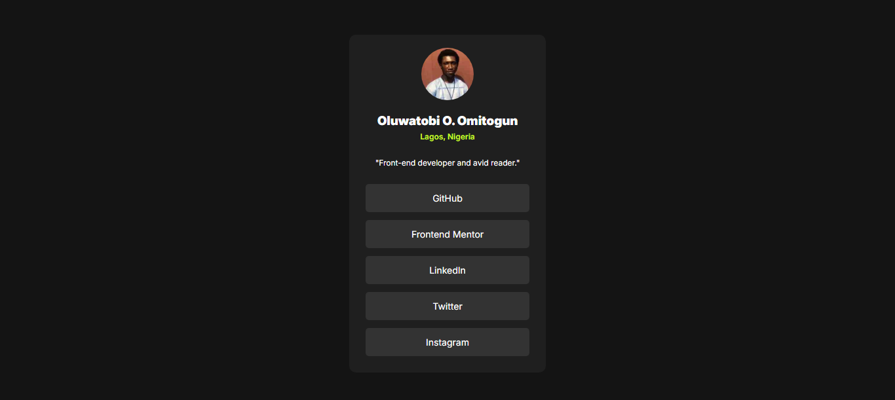

# Frontend Mentor - Social links profile solution

This is a solution to the [Social links profile challenge on Frontend Mentor](https://www.frontendmentor.io/challenges/social-links-profile-UG32l9m6dQ). Frontend Mentor challenges help you improve your coding skills by building realistic projects. 

## Table of contents

- [Overview](#overview)
  - [The challenge](#the-challenge)
  - [Screenshot](#screenshot)
  - [Links](#links)
- [My process](#my-process)
  - [Built with](#built-with)
  - [What I learned](#what-i-learned)
  - [Continued development](#continued-development)
- [Author](#author)


## Overview

### The challenge

Users should be able to:

- See hover and focus states for all interactive elements on the page

### Screenshot



### Links

- Solution URL: [GitHub Repository](https://github.com/iBotayo/social-links-profile-main)
- Live Site URL: [Oluwatobi O. Omitogun](https://oluwatobisocials.netlify.app/)

## My process

### Built with

- Semantic HTML5 markup
- CSS custom properties
- Flexbox
- Mobile-first workflow

### What I learned

While working on this project, I solidify my knowledge on how to structure and position contents in the center using flexbox. With this, I was able to increase my knowledge on flexbox. Also, I used the mobile-first approach in designing.

To see how you can add code snippets, see below:

```css
body {
    background: var(--grey-900);
    display: flex;
    flex-direction: column;
    gap: 22px;
    justify-content: center;
    align-items: center;
    margin-top: 20%;
}
```

### Continued development

I would continue to expand my knowledge in flexbox, CSS Grid, mobile-first design approach and also learn to add JavaScript for responsiveness.

## Author

- Frontend Mentor - [@iBotayo](https://www.frontendmentor.io/profile/iBotayo)
- Twitter - [@O_ibot](https://www.twitter.com/O_ibot)
- GitHub - [iBotayo](https://www.github.com/ibotayo)
